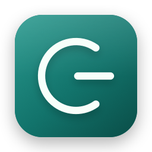
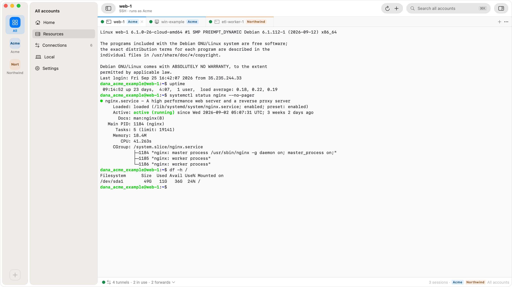
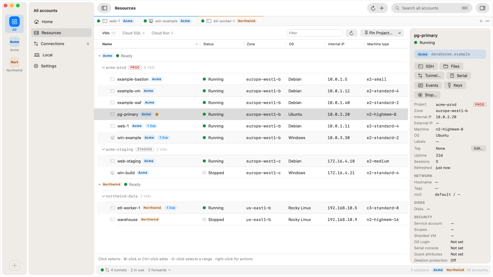
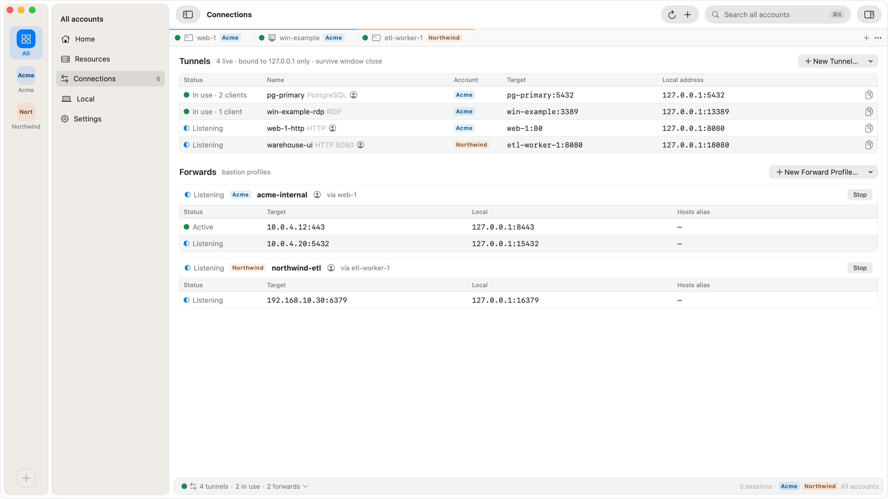

<p align="center">
  
</p>

<h1 align="center">Ostgate</h1>

<p align="center">
  SSH, RDP, SFTP and TCP tunnels to Google Compute Engine VMs through Identity-Aware Proxy.<br>
  A native macOS app. No public IPs, no bastion hosts, no gcloud.
</p>

<p align="center">
  <a href="https://github.com/ostgate/ostgate-iap-app/releases/latest"><b>Download the latest release</b></a> ·
  <a href="https://ostgate.app">Website</a> ·
  <a href="https://ostgate.app/docs">Docs</a> ·
  <a href="CHANGELOG.md">Release notes</a>
</p>

<picture>
  <source media="(prefers-color-scheme: dark)" srcset="docs/screenshots/ssh-dark.png">
  
</picture>

Ostgate reaches Google Compute Engine VMs through Google's Identity-Aware Proxy (IAP): SSH
terminals, RDP desktops, SFTP and TCP tunnels to instances with no public IP and no bastion
host. It runs entirely on your Mac and talks to Google's APIs as you; there is no Ostgate
server in the path. If you know Google's Windows-only IAP Desktop, Ostgate is IAP Desktop
for the Mac: the same IAP TCP forwarding and project setup, as a native macOS app.

This repository hosts the release builds, release notes and issue tracker. The source code is
not public.

## Features

- **Connections.** SSH terminal tabs, embedded Remote Desktop (RDP) for Windows VMs, an SFTP
  file browser, and TCP tunnels from any VM port to `127.0.0.1` with presets for PostgreSQL,
  MySQL, SQL Server, Redis and HTTP(S).
- **Bastion forwards.** One SSH session through a chosen VM carries several forwards to
  anything that VM can reach, such as an internal load balancer or a Cloud SQL private IP.
- **Cloud SQL and Cloud Run.** Open a tunnel to a Cloud SQL private IP, or an internal-only
  Cloud Run service in the browser, through IAP.
- **Several Google accounts side by side,** each with its own tokens, SSH key, tunnels and
  settings, in a rail on the left with a problems badge per account and `⌥⌘1…9` to switch.
- **Sessions that say where they go.** Every SSH and RDP tab carries a session bar with its
  status, account, `user@vm`, address, route and Disconnect.
- **Files.** Upload and download whole folders; folders and many small files travel packed
  with `tar` over the same connection, with nothing written to the VM's disk.
- **Tunnels that stay up** through relay drops, Wi-Fi outages and sleep, with a choice of the
  VM's network interface and a per-tunnel access level (Ostgate only, your processes, or any
  local process).
- **SSH keys generated on your Mac** (Secure Enclave P-256 where available) and published
  through OS Login or instance metadata. Host keys are verified.
- **Terminal integration.** One click adds a `Host *.gcp` block to `~/.ssh/config`, so
  `ssh INSTANCE.ZONE.PROJECT.gcp` works from any terminal, IDE or script.
- **Connection Doctor** names the cause of a failed connection (missing
  `roles/iap.tunnelResourceAccessor`, missing firewall rule for `35.235.240.0/20`, stopped VM)
  and gives the fix.

<table>
  <tr>
    <td>
      <picture>
        <source media="(prefers-color-scheme: dark)" srcset="docs/screenshots/resources-dark.png">
        
      </picture>
    </td>
    <td>
      <picture>
        <source media="(prefers-color-scheme: dark)" srcset="docs/screenshots/tunnels-dark.png">
        
      </picture>
    </td>
  </tr>
</table>

## Requirements

- macOS 26.3 or later, Apple Silicon.
- A Google account with access to a Google Cloud project that allows IAP TCP forwarding: the
  `roles/iap.tunnelResourceAccessor` role and a firewall rule admitting `35.235.240.0/20`.
  [Project setup](https://ostgate.app/docs) walks through it.
- No gcloud SDK.

## Install

1. Download `Ostgate-<version>.dmg` from [Releases](https://github.com/ostgate/ostgate-iap-app/releases/latest).
2. Open it and drag **Ostgate** onto **Applications**.
3. Launch Ostgate and sign in with Google in your own browser.

Every build is signed with a Developer ID certificate and notarized by Apple, so it opens
without Gatekeeper warnings. To check a download yourself:

```sh
shasum -a 256 Ostgate-<version>.dmg            # compare with the release notes
spctl -a -vv -t open --context context:primary-signature Ostgate-<version>.dmg
codesign -dv /Applications/Ostgate.app 2>&1 | grep TeamIdentifier   # C83FBCDMHY
```

## License and trial

Ostgate is commercial software. It starts with a 7-day free trial, with no sign-up; after
that it needs a license key. A key covers the whole app on two Macs: $79 a year or $9 a month
for individuals, $129 per user a year for companies. See [Pricing](https://ostgate.app/pricing).
Use of the app is governed by the [Terms of Service](https://ostgate.app/terms); see
[LICENSE](LICENSE).

## Privacy

Your Google tokens are stored in the macOS Keychain. API calls go directly from your Mac to
Google. There is no telemetry. The [Privacy Policy](https://ostgate.app/privacy) lists what
each OAuth scope is used for and where data is stored.

## Support

- Bugs and feature requests: [open an issue](https://github.com/ostgate/ostgate-iap-app/issues/new/choose).
- Security problems: see [SECURITY.md](SECURITY.md); please do not file them as public issues.
- Everything else: [support@ostgate.app](mailto:support@ostgate.app).

---

Not affiliated with, endorsed by, or sponsored by Google. Google Cloud, Compute Engine and
Identity-Aware Proxy are trademarks of Google LLC.
